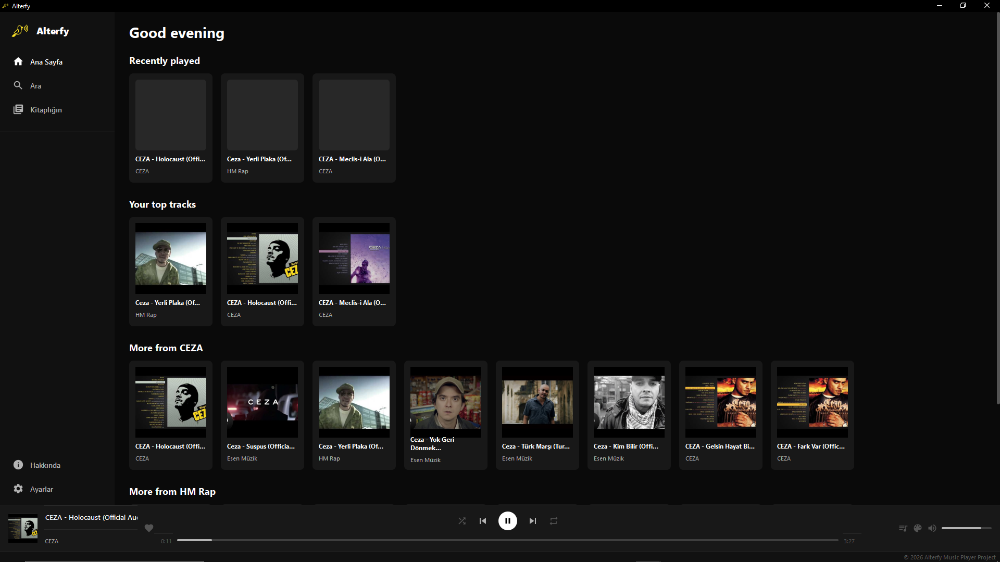
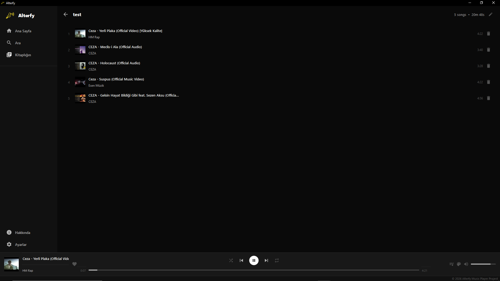

# Alterfy 

**Alterfy**, YouTube üzerinden müzik dinleme deneyimini masaüstüne taşıyan, Spotify estetiğine sahip, hafif ve yüksek performanslı bir müzik çalar uygulamasıdır.  
`yt-dlp` gücüyle milyonlarca parçaya erişirken, `VLC` motoru ile kristal netliğinde ses sunar.

---

# 📸 Ekran Görüntüleri

| Ana Sayfa & Keşfet | Çalma Listesi Görünümü |
|--------------------|------------------------|
|  |  |

---

# ✨ Öne Çıkan Özellikler

- 🎨 **Modern Tasarım**  
  Akıcı animasyonlar, yuvarlatılmış köşeler ve karanlık mod desteği.

- 🔍 **Gelişmiş Arama**  
  Sanatçı, albüm veya parça bazlı anlık YouTube araması.

- ⚡ **Asenkron Mimari**  
  Arama ve yükleme işlemleri arka planda (`QThread`) yapılır, arayüz asla donmaz.

- 📚 **Yerel Kütüphane**  
  Kişiselleştirilmiş çalma listeleri oluşturma ve favori yönetimi.

- ⌨️ **Global Kısayollar**  
  `keyboard` modülü entegrasyonu ile arka planda kontrol imkanı.

- 🌍 **Çoklu Dil Desteği**  
  `i18n` modülü ile yerelleştirilmiş kullanıcı deneyimi.

---

# 🛠️ Kurulum

## Gereksinimler

- [Python 3.10+](https://www.python.org/)
- [VLC Media Player](https://www.videolan.org/vlc/)  
  > Uygulamanın ses motoru için sisteminizde VLC Media Player kurulu ve `PATH` değişkenine eklenmiş olmalıdır.

---

## Kurulum Adımları

```bash
# Depoyu klonlayın
git clone https://github.com/brt222/alterfy.git

# Proje dizinine gidin
cd alterfy

# Gerekli bağımlılıkları yükleyin
pip install -r requirements.txt
```

---

# 🚀 Kullanım

Uygulamayı başlatmak için:

```bash
python main.py
```

## Temel Kullanım

### 🔎 Arama

Üst bardaki arama kutusuna şarkı adını yazıp `Enter` tuşuna basın.

### ▶️ Oynatma

Kartlara çift tıklayarak veya sağ tık menüsünden **"Play Now"** seçeneğini kullanarak oynatabilirsiniz.

### ➕ Playlist Yönetimi

Şarkı kartlarındaki `+` butonuna basarak parçaları kütüphanenize ekleyebilirsiniz.

---

# 📦 Kullanılan Teknolojiler

- `PyQt6`
- `yt-dlp`
- `python-vlc`
- `requests`
- `keyboard`
- `pillow`

---

# 📜 Lisans

Bu proje lisanslı bir içeriğe sahiptir.  
Detaylı bilgi için `LICENSE.md` dosyasını inceleyin.

---

# 🤝 Katkıda Bulunma

1. Projeyi fork edin

2. Özellik dalı oluşturun:

```bash
git checkout -b feature/YeniOzellik
```

3. Değişikliklerinizi commit edin:

```bash
git commit -m "Eklendi: Yeni özellik"
```

4. Dalınıza push atın:

```bash
git push origin feature/YeniOzellik
```

5. Bir Pull Request açın 🚀

---

# 💫 Slogan

> **Alterfy — Alternative for music, but alterfied.**
